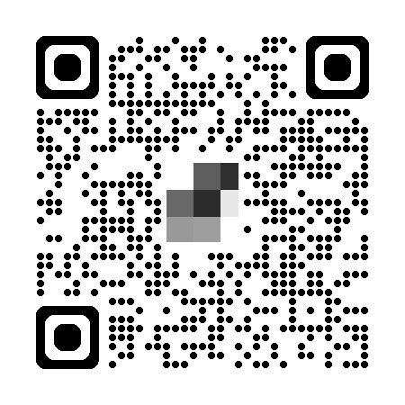

[")](https://globalazure.net/events/b8924497-f083-465c-94d6-36a40d629064)

+ Date : ***(Sat)*** **May 10, 2025**
+ Time : **4:00** PM - **8:00** PM
+ Venue : **Virtual Event**
+ Call for Speaker : ***[Sessionize](https://sessionize.com/azure-sec-eve-2025)***
+ Join the Event : **[Zoom Meeting](https://us05web.zoom.us/j/4949499449?pwd=oKrfBPnJygSpaK3aUBS9NFjbaZLC4K.1&omn=82872624389)**
	+ Meeting ID: ***494 949 9449***
	+ Passcode: ***AzSecEve25***
	+ 

### Confirmed Speaker(s)
+ **Sarah Saran Hansakul**
	+ ThaiCySec - Steering Thai Security to Global Excellence
	+ ***Topic : From Zero to Heroine as true Azure Security Professional for “FREE”***
	+ **16:30 - 17:30**
+ **Chonlatit Rujitphut**
	+ VP & Co-founder of iKNEX (Thailand)
	+ ***Topic : Meet Copilot, Your AI Assistant for Work & Security Best Practices***
	+ **17:30 - 18:30**
+ **Wisit Thongphoo**
	+ Microsoft MVP - Security
	+ ***Topic : Planning and Securing Active Directory-Based Identity Solutions***
	+ **18:30 - 19:30**

* **more info** : Maykin Warasart's **[LINE](https://line.me/R/ti/p/@maykin)** or **[WhatsApp](https://api.whatsapp.com/send?phone=66832725900)**